#Inktober 2016

This is a collection of drawings done for [inktober](http://mrjakeparker.com/inktober)

I've taken part a couple of times and never finished. So this time I thought if I had a theme and a plan of which drawings to do on which days I would have a better chance of completing the challenge. (Update: I did finish!)

#Thumbnails
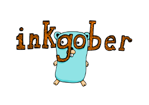
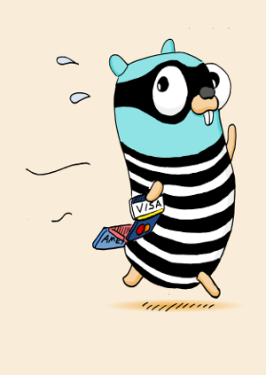
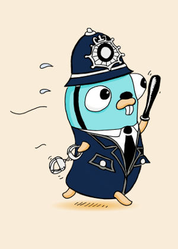
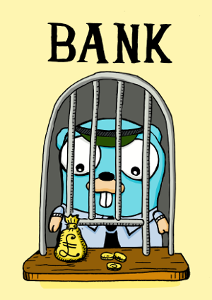
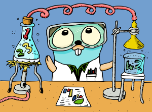
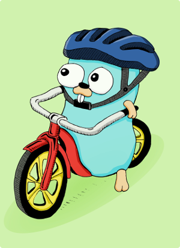
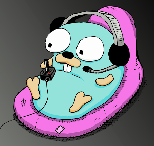
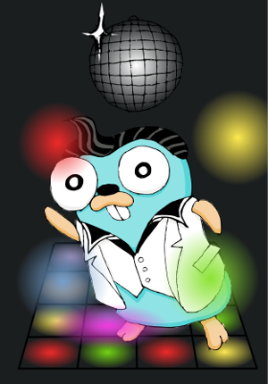
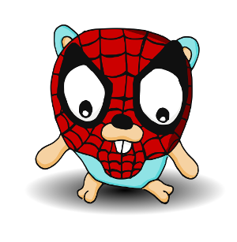
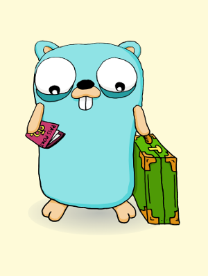
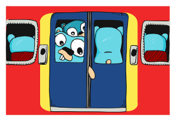

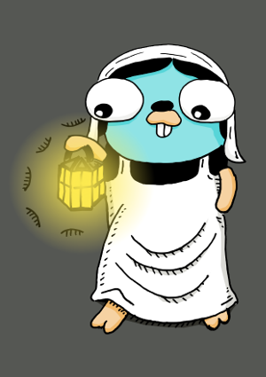
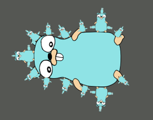

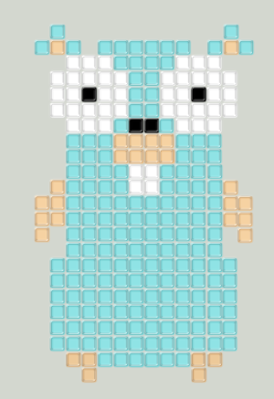
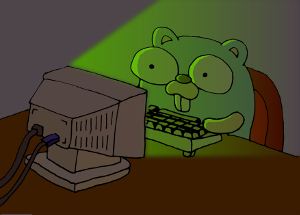

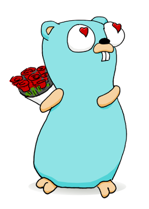
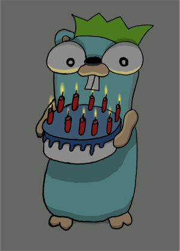

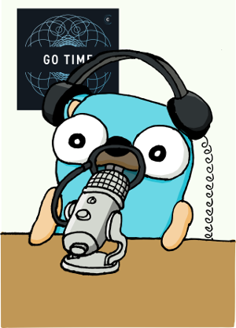
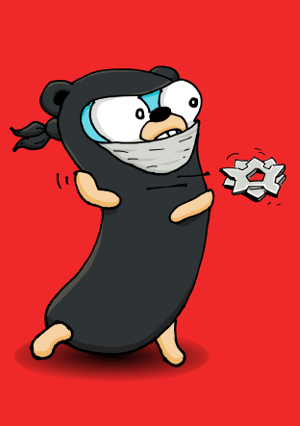

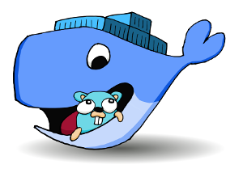
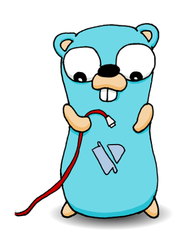
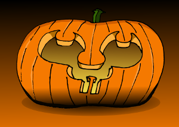

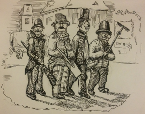
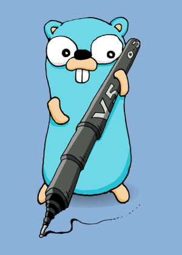

## Producing the drawings
Most of the drawings where drawn on my commute to work on the train.  They took between 20-30 mins to sketch out.

I decided I would also produce digital versions of the drawings and maybe even some coloured in versions.

## Steps involved
These steps are documented mainly for my benefit so I can easily repeat the process.

* Sketch with pencil / inkpen
* Scan image
* Convert to 1 bit b/w image
* Import into Inkscape
* Trace as bitmap
* 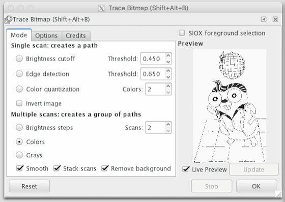
* Export as black and white svg/png
* Colour in
* Export as colour svg/png
